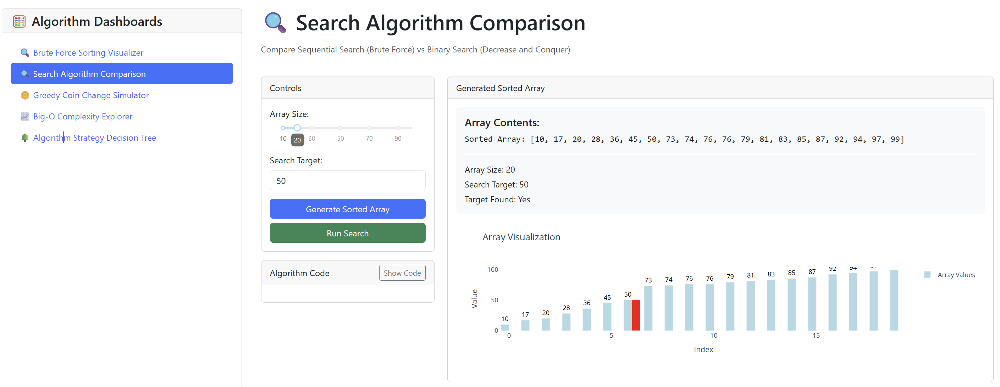

# Lab 1 – GitHub Introduction

## What I Learned
I learned about the **reasons for git**, the potential it has to host a wide variety of projects, and the basics of how to set it up.  
GitHub is a *great, user-friendly* way to implement git, and I am looking forward to using it more.

## Questions / Confusions
- I am still a bit confused about how to ensure that things get **pushed to the correct repository**.
- I think I will get more used to this after the first project or two.

## Key Takeaways
1. Git is a version control system.
2. GitHub provides a cloud-based platform for using git.
3. Markdown makes documentation easier and more readable.

---

### Experimenting with Markdown Styles
- **Bold text**
- *Italic text*
- ~~Strikethrough~~  
- Inline code: `git push origin main`

> This is a blockquote example.

```python
# Code block example
print("Hello, GitHub Classroom!")

# Algorithms Dashboard Screenshot


